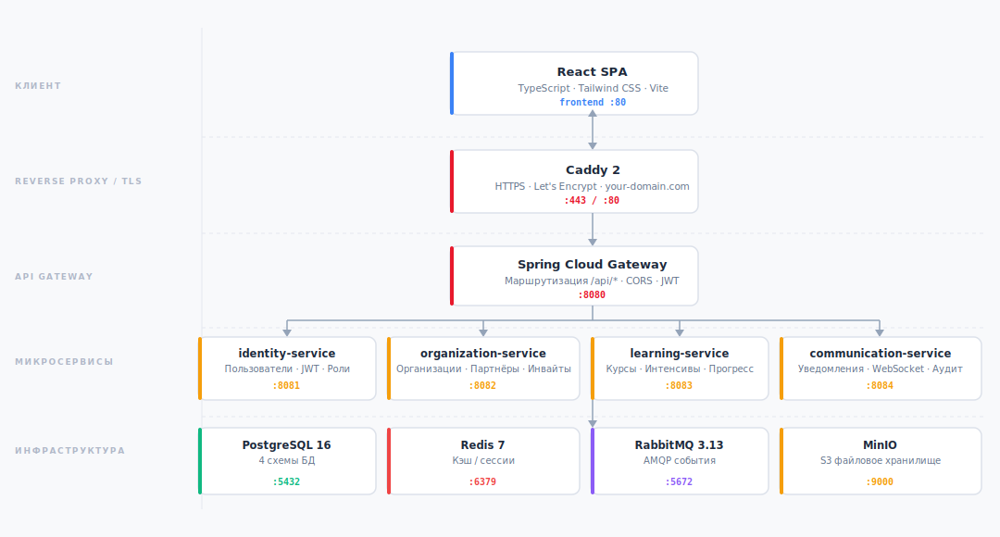

<p align="center">
  
</p>

<h1 align="center">РЕД Академия</h1>

<p align="center">
  <a href="https://редакадемия.рф">
    
  </a>
</p>

<p align="center">
  
  
  
  
  
  
</p>

<p align="center">
  Корпоративная платформа для управления обучением — курсы, интенсивы, сертификаты и аналитика в одном месте.
</p>

---

## Что внутри?

Микросервисная архитектура на Java + Spring Boot, SPA на React/TypeScript, всё поднимается одной командой через Docker Compose.

<p align="center">
  
</p>

| Сервис | Назначение |
|---|---|
| `identity-service` | Регистрация, авторизация, JWT, управление пользователями |
| `organization-service` | Организации, партнёрские заявки, сотрудники, инвайты |
| `learning-service` | Курсы, уроки, тесты, интенсивы, задания, сертификаты |
| `communication-service` | Уведомления (WebSocket + RabbitMQ), аудит |
| `gateway` | Единая точка входа, CORS, проксирование |
| `frontend` | React SPA (Vite + TypeScript + Tailwind) |

---

## Быстрый старт

### Требования

- Docker 24+ и Docker Compose v2
- Порты `5173` и `8080` должны быть свободны

### Локальная разработка

```bash
git clone <repo-url>
cd lms-platform

cp .env.example .env
# При необходимости поменяй пароли и JWT-секреты

docker compose up --build -d \
  postgres redis rabbitmq minio \
  identity-service organization-service learning-service communication-service \
  gateway frontend
```

После сборки (~3–5 минут в первый раз):

| Что | URL |
|---|---|
| Платформа | `http://localhost:5173` |
| API Gateway | `http://localhost:8080` |
| RabbitMQ UI | `http://localhost:15672` |
| MinIO Console | `http://localhost:9001` |

> Caddy для локалки не нужен — он только для прода с доменом и HTTPS.

### Прод (с доменом и TLS)

Раскомментируй в `.env` блок Caddy, укажи домен и email, затем:

```bash
docker compose up --build -d
```

Caddy сам получит сертификат Let's Encrypt и поднимет HTTPS.

### Остановка

```bash
docker compose down        # остановить
docker compose down -v     # остановить + сбросить все данные
```

---

## Переменные окружения

Все настройки — в файле `.env` (создаётся из `.env.example`).

**Обязательно сменить перед деплоем:**

| Переменная | Описание |
|---|---|
| `JWT_ACCESS_SECRET` | Секрет для подписи access-токенов |
| `JWT_REFRESH_SECRET` | Секрет для подписи refresh-токенов |
| `POSTGRES_PASSWORD` | Пароль PostgreSQL |
| `RABBITMQ_PASSWORD` | Пароль RabbitMQ |
| `MINIO_ROOT_PASSWORD` | Пароль MinIO |

---

## Роли пользователей

| Роль | Описание |
|---|---|
| `ADMIN` | Полный доступ: модерация, управление организациями и пользователями |
| `PARTNER_MANAGER` | Управление компанией-партнёром, доступ к корпоративным курсам |
| `MENTOR` | Проверка заданий, выставление оценок в интенсивах |
| `STUDENT` | Прохождение публичных курсов |
| `CORPORATE_STUDENT` | Прохождение курсов своей организации |

---

## Стек

**Backend** — Java 17, Spring Boot 3.3.5, Spring Security (JWT), JdbcTemplate (без ORM), Maven multi-module

**Frontend** — React 18, TypeScript, Vite, Tailwind CSS, framer-motion, lucide-react

**Хранилище** — PostgreSQL 16 (4 схемы), Redis 7, MinIO (S3)

**Очередь** — RabbitMQ 3.13, async-события между сервисами + WebSocket для уведомлений

**Инфраструктура** — Docker Compose, Caddy 2 (прод, автоматический TLS)

---

## Схема базы данных

Одна база PostgreSQL, разбитая на 4 схемы:

```
identity      → users, sessions, refresh_tokens
organization  → organizations, members, invites, partner_requests
learning      → courses, modules, lessons, enrollments,
                intensives, tasks, task_submissions, certificates
communication → notifications, audit_log
```

Миграции применяются автоматически при первом старте PostgreSQL из нумерованных SQL-файлов в корне `migrations/`.

---
